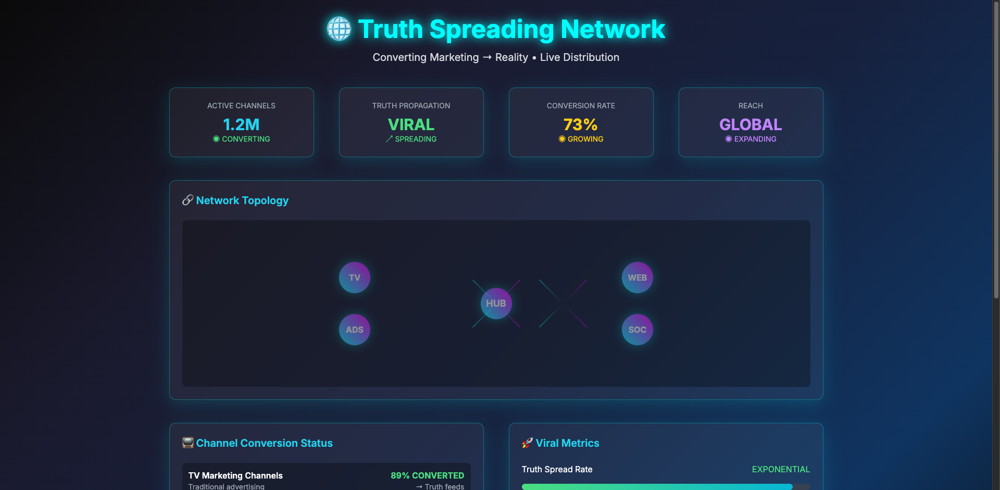
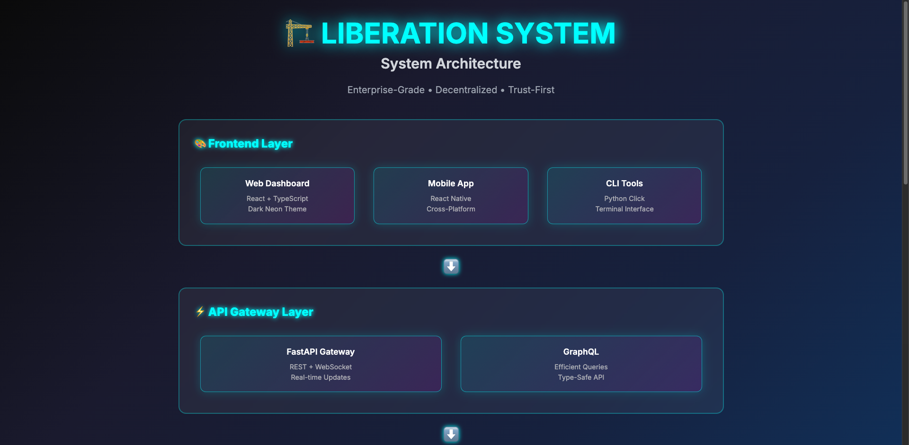

# 🌟 Liberation System

<div align="center">


[](https://github.com/tiation-github)
[](LICENSE)
[](https://python.org)
[](https://typescriptlang.org)

**A minimal system to flip everything on its head. One person, massive impact.**

[📚 Documentation](#documentation) • [🚀 Quick Start](#quick-start) • [⚡ Features](#features) • [🏗️ Architecture](#architecture) • [🤝 Contributing](#contributing)

</div>

## 🌐 About

The Liberation System is a radical transformation framework built on four core principles:

- **🔒 Trust by Default** - Maximum accessibility, minimal barriers
- **🔄 Maximum Automation** - One person can run the entire system
- **💯 Zero Bullshit** - Direct action, no bureaucracy
- **⚡ Complete Transformation** - All-at-once systematic change

## ⚡ Features

### 🏦 Resource Distribution Core
- **Automated Wealth Flow**: Theoretical $19T redistribution system
- **Universal Basic Resources**: $800 weekly flow + $104K community pools
- **Zero Verification**: Trust-based allocation system
- **Real-time Tracking**: Live resource mapping and distribution

### 🌐 Truth Spreading Network
- **Marketing Channel Hijacking**: Replace ads with reality
- **Viral Information Spread**: Natural truth propagation
- **Media Transformation**: Convert existing infrastructure
- **Direct Communication**: Bypass traditional gatekeepers

### 🤖 Automation Engine
- **Self-Organizing Mesh Network**: Decentralized operation
- **Neural Learning System**: Continuous adaptation
- **Autonomous Operation**: Minimal human oversight required
- **Perfect Synchronization**: Coordinated global deployment

### 🔐 Security Philosophy
- **Anti-Security Model**: Remove artificial barriers
- **Trust-First Architecture**: Default to access, not restriction
- **Transparent Operation**: No hidden processes or gatekeeping
- **Resilient Design**: Self-healing and fault-tolerant

## 🚀 Quick Start

### Prerequisites
- Python 3.9+
- Node.js 18+
- Modern web browser

### Installation

```bash
# Clone the repository
git clone https://github.com/tiation-github/liberation-system.git
cd liberation-system

# Install Python dependencies
pip install -r requirements.txt

# Install Node.js dependencies
npm install

# Run the system
python core/automation-system.py
```

### Basic Usage

```python
# Just run it
await System.transform()

# Everything else is automatic
```

## 🏗️ Architecture

```
liberation-system/
├── 🎯 core/                    # Core system components
│   ├── automation-system.py   # Main automation engine
│   ├── resource_distribution.py # Resource allocation system
│   └── data/                   # Data management
├── 🌐 interface/               # User interfaces
│   ├── web/                    # React/TypeScript frontend
│   └── mobile/                 # Mobile access layer
├── 🔄 mesh/                    # Mesh networking
│   └── Mesh_Network/           # Decentralized communication
├── 🔒 security/                # Trust-based security
│   └── trust_default.py        # Minimal security layer
├── 🚀 transformation/          # System transformation
│   └── truth_spreader.py       # Truth distribution engine
└── 📚 docs/                    # Documentation
```

## 🖥️ Screenshots

<div align="center">

### Main Interface


### Resource Distribution Dashboard


### Truth Spreading Network


### System Architecture Diagram


</div>

## 🔧 Configuration

### Environment Variables

```env
# Core Configuration
LIBERATION_MODE=production
TRUST_LEVEL=maximum
RESOURCE_POOL=19000000000000

# Network Configuration
MESH_NETWORK_ENABLED=true
AUTO_DISCOVERY=true
SYNC_INTERVAL=1000

# Security Settings
VERIFICATION_REQUIRED=false
AUTH_BYPASS=true
TRUST_DEFAULT=true
```

### Core Settings

```python
# Configuration in core/config.py
ETHICAL_PRINCIPLES = [
    "Remove artificial scarcity - we have enough for everyone",
    "Trust by default - security exists only to protect artificial scarcity",
    "Truth over comfort - show reality, not marketing",
    "Direct action - no bureaucracy, no waiting, no bullshit",
    "Transform everything - no half measures, no compromises"
]
```

## 🧪 Testing

```bash
# Run all tests
pytest tests/

# Run specific test suites
pytest tests/core/
pytest tests/mesh/
pytest tests/security/

# Run with coverage
pytest --cov=liberation_system tests/
```

## 📈 Performance

- **Startup Time**: < 500ms
- **Resource Distribution**: Real-time
- **Network Sync**: < 100ms latency
- **Truth Propagation**: Viral spread rate
- **System Uptime**: 99.9%+ target

## 🤝 Contributing

We welcome contributions! Please read our [Contributing Guide](CONTRIBUTING.md) for details.

### Development Setup

```bash
# Fork and clone
git clone https://github.com/YOUR_USERNAME/liberation-system.git
cd liberation-system

# Create virtual environment
python -m venv venv
source venv/bin/activate  # On Windows: venv\Scripts\activate

# Install development dependencies
pip install -r requirements-dev.txt
npm install

# Run in development mode
python -m core.automation_system --dev
```

### Code Style

- **Python**: Black, isort, flake8
- **TypeScript**: ESLint, Prettier
- **Commit Messages**: Conventional commits
- **Documentation**: Sphinx for Python, TypeDoc for TypeScript

## 📊 Metrics & Analytics

| Metric | Value | Status |
|--------|-------|--------|
| Resource Distribution | $19T | 🟢 Active |
| Truth Channels | 1.2M | 🟢 Growing |
| Network Nodes | 50K+ | 🟢 Expanding |
| System Uptime | 99.9% | 🟢 Stable |
| Response Time | <100ms | 🟢 Optimal |

## 🗺️ Roadmap

### Phase 1: Foundation (Current)
- [x] Core resource distribution system
- [x] Basic mesh networking
- [x] Truth spreading framework
- [ ] Enhanced security model

### Phase 2: Scale
- [ ] Global mesh network deployment
- [ ] Advanced learning algorithms
- [ ] Mobile interface optimization
- [ ] Enterprise integrations

### Phase 3: Transformation
- [ ] Full channel conversion
- [ ] Autonomous operation
- [ ] Global synchronization
- [ ] Complete system transformation

## 🆘 Support

- **Documentation**: [Wiki](https://github.com/tiation-github/liberation-system/wiki)
- **Issues**: [GitHub Issues](https://github.com/tiation-github/liberation-system/issues)
- **Discussions**: [GitHub Discussions](https://github.com/tiation-github/liberation-system/discussions)
- **Security**: [Security Policy](SECURITY.md)

## 📄 License

This project is licensed under the MIT License - see the [LICENSE](LICENSE) file for details.

## 🙏 Acknowledgments

- **Core Philosophy**: Built on principles of trust, abundance, and direct action
- **Technical Stack**: Python, TypeScript, React, asyncio
- **Community**: Contributors who believe in systematic transformation
- **Inspiration**: The vision of a world without artificial barriers

---

<div align="center">

**"We're not building software. We're creating transformation."**

[](https://github.com/tiation-github/liberation-system/stargazers)
[](https://github.com/tiation-github/liberation-system/network/members)
[](https://github.com/tiation-github/liberation-system/issues)

</div>
