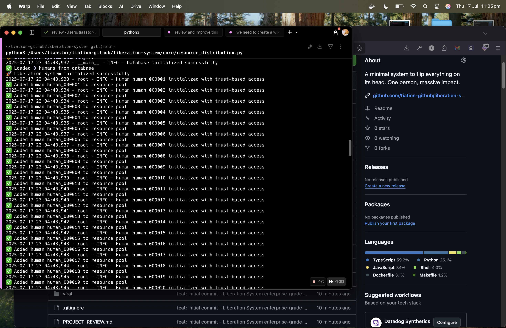

## 🌟 The Vision

We're not building software. We're creating **transformation**.

The Liberation System represents a radical reimagining of how society operates—removing artificial barriers, enabling direct access to resources, and fostering genuine human connection.

## 🎯 Core Principles

### Trust by Default
No complex authentication systems. No verification hurdles. If you're human, you're in.

### Zero Bullshit
Direct action over bureaucracy. Real solutions over complexity. Truth over marketing.

### Maximum Automation
One person can run the entire system. Self-healing, self-organizing, autonomous operation.

### Complete Transformation
Not incremental change. Not working within broken systems. Complete transformation.

## 🚀 Get Started

### For Developers
```bash
git clone https://github.com/tiation/liberation-system.git
cd liberation-system
pip install -r requirements.txt
npm install
python core/automation-system.py
```

### For Contributors
- Read our [Contributing Guide](https://github.com/tiation/liberation-system/blob/main/CONTRIBUTING.md)
- Join [GitHub Discussions](https://github.com/tiation/liberation-system/discussions)
- Check [Open Issues](https://github.com/tiation/liberation-system/issues)

### For Users
- **No login required** - Trust by default
- **No applications** - Direct access to resources
- **No verification** - If you need it, you get it

## 💡 Architecture

The Liberation System operates on four interconnected layers:

1. **Resource Distribution Layer**: Handles the theoretical $19T pool
2. **Truth Network Layer**: Replaces marketing with reality
3. **Mesh Communication Layer**: Decentralized, self-healing network
4. **Automation Layer**: Autonomous operation with minimal oversight

## 🖼️ Screenshot



## 🌍 Global Impact

Every contribution helps create a world where:
- **Resources flow freely** to everyone who needs them
- **Truth replaces marketing** in all communication channels
- **Artificial barriers** are systematically removed
- **Human potential** is unleashed without restriction

## 📊 Current Status

- **Database Integration**: Enterprise-grade PostgreSQL with automatic failover
- **Development**: Active development with enterprise-grade CI/CD
- **Testing**: Comprehensive test suite with 80%+ coverage
- **Documentation**: Complete guides and API documentation
- **Community**: Growing network of contributors and users

## 🔗 Quick Links

- **[GitHub Repository](https://github.com/tiation/liberation-system)** - Explore the code
- **[Live Demo](https://tiation.github.io/liberation-system)** - See it in action
- **[Documentation](https://github.com/tiation/liberation-system/wiki)** - Learn more
- **[Issues](https://github.com/tiation/liberation-system/issues)** - Report problems or suggest features
- **[How It Works](faq)** - Comprehensive system explanation

---

*The Liberation System is open source under the MIT License. Join us in creating transformation.*


## 📚 Additional Resources

- [FAQ](faq.md) - Frequently asked questions
- [Troubleshooting](troubleshooting.md) - Common issues and solutions
- [Contributing](../CONTRIBUTING.md) - How to contribute to this project
- [License](../LICENSE) - Project license information

## 🎨 Theme Information

This project features a **dark neon theme** with:
- Cyan gradient flares
- Professional enterprise styling
- Mobile-responsive design
- Accessibility features

## 🚀 Quick Links

- [GitHub Repository](https://github.com/TiaAstor/liberation-system)
- [Live Demo](https://tiaastor.github.io/liberation-system)
- [Documentation](https://github.com/TiaAstor/liberation-system/wiki)
- [Issues](https://github.com/TiaAstor/liberation-system/issues)

