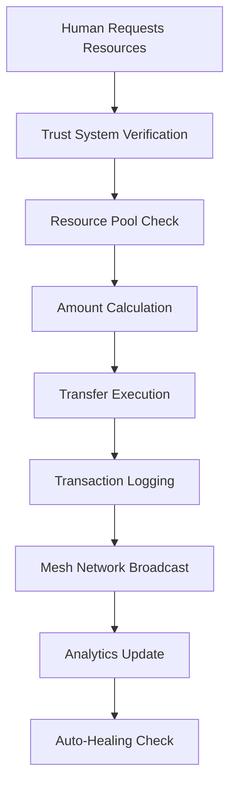
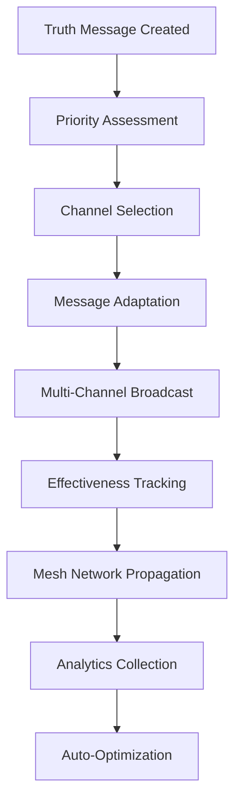
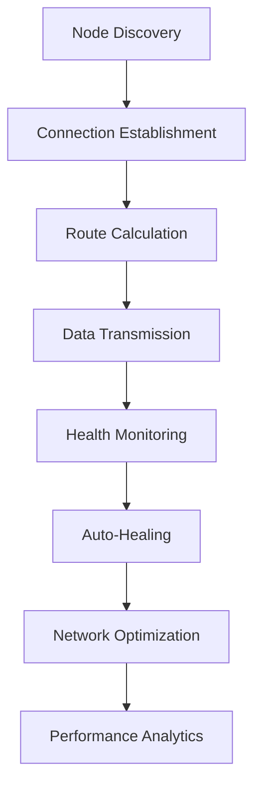

# 🏗️ Liberation System Architecture

<div align="center">


**Enterprise-Grade Architecture for the $19 Trillion Economic Transformation**

</div>

---

## 🎯 Architecture Overview

The Liberation System is designed as a **distributed, fault-tolerant, trust-first architecture** that can scale globally while maintaining simplicity and direct action principles.

### Core Design Principles

```python
architectural_principles = {
    "simplicity": "Make it so simple it just works",
    "autonomy": "System handles everything itself", 
    "resilience": "No single points of failure",
    "coverage": "Transform everything at once",
    "trust": "Default to access, not restriction",
    "transparency": "All operations visible and auditable"
}
```

---

## 🔧 System Components

### 1. Core Services Layer

| **Service** | **Technology** | **Purpose** | **Status** |
|-------------|----------------|-------------|------------|
| **Resource Distribution** | Python + asyncio | $19T allocation system | 🟡 Partial |
| **Truth Spreading** | Python + aiohttp | Marketing → Reality conversion | 🟡 Partial |
| **Mesh Network** | Python + WebRTC | Decentralized communication | 🔴 Needs Work |
| **Automation Engine** | Python + Rich | Self-operating system | 🟢 Functional |
| **Trust Security** | Python | Zero-verification access | 🟢 Functional |

### 2. Interface Layer

| **Component** | **Technology** | **Purpose** | **Status** |
|---------------|----------------|-------------|------------|
| **Web Dashboard** | React + TypeScript | User interface | 🟡 Partial |
| **Mobile Access** | React Native | Mobile interface | 🔴 Missing |
| **API Gateway** | FastAPI | External integrations | 🔴 Missing |
| **CLI Tools** | Python Click | Command-line interface | 🔴 Missing |

### 3. Data Layer

| **Component** | **Technology** | **Purpose** | **Status** |
|---------------|----------------|-------------|------------|
| **Resource Database** | SQLite/PostgreSQL | Financial records | 🟡 SQLite Only |
| **Truth Database** | SQLite/PostgreSQL | Message propagation | 🔴 Missing |
| **Mesh Database** | SQLite/PostgreSQL | Network topology | 🔴 Missing |
| **Analytics** | ClickHouse | Performance metrics | 🔴 Missing |

---

## 🚀 Technical Stack

### Backend Architecture

```python
# Core Technology Stack
backend_stack = {
    "runtime": "Python 3.9+",
    "async_framework": "asyncio",
    "web_framework": "FastAPI",
    "database": "PostgreSQL + SQLite",
    "messaging": "Redis + WebSockets",
    "monitoring": "Prometheus + Grafana",
    "logging": "Rich + Structured Logging"
}
```

### Frontend Architecture

```typescript
// Frontend Technology Stack
const frontendStack = {
  framework: "Next.js 14",
  language: "TypeScript",
  styling: "Tailwind CSS",
  components: "Radix UI",
  state: "Zustand",
  data: "React Query",
  charts: "Chart.js + D3.js",
  theme: "Dark Neon Gradient"
}
```

### Infrastructure

```yaml
# Infrastructure Stack
infrastructure:
  containerization: "Docker + Docker Compose"
  orchestration: "Kubernetes (optional)"
  ci_cd: "GitHub Actions"
  monitoring: "Prometheus + Grafana"
  logging: "ELK Stack"
  security: "Trust-First Model"
```

---

## 🏛️ Architectural Patterns

### 1. Microservices with Mesh Communication

```
┌─────────────────────────────────────────────────────────────┐
│                    Liberation System                        │
├─────────────────────────────────────────────────────────────┤
│  Frontend Layer                                             │
│  ┌─────────────┐  ┌─────────────┐  ┌─────────────┐        │
│  │ Web Dashboard│  │ Mobile App  │  │ CLI Tools   │        │
│  └─────────────┘  └─────────────┘  └─────────────┘        │
├─────────────────────────────────────────────────────────────┤
│  API Gateway Layer                                          │
│  ┌─────────────────────────────────────────────────────────┐│
│  │              FastAPI Gateway                            ││
│  └─────────────────────────────────────────────────────────┘│
├─────────────────────────────────────────────────────────────┤
│  Core Services Layer                                        │
│  ┌─────────────┐  ┌─────────────┐  ┌─────────────┐        │
│  │ Resource    │  │ Truth       │  │ Mesh        │        │
│  │ Distribution│  │ Spreading   │  │ Network     │        │
│  └─────────────┘  └─────────────┘  └─────────────┘        │
│  ┌─────────────┐  ┌─────────────┐  ┌─────────────┐        │
│  │ Automation  │  │ Trust       │  │ Analytics   │        │
│  │ Engine      │  │ Security    │  │ Service     │        │
│  └─────────────┘  └─────────────┘  └─────────────┘        │
├─────────────────────────────────────────────────────────────┤
│  Data Layer                                                 │
│  ┌─────────────┐  ┌─────────────┐  ┌─────────────┐        │
│  │ PostgreSQL  │  │ Redis       │  │ ClickHouse  │        │
│  │ (Primary)   │  │ (Cache)     │  │ (Analytics) │        │
│  └─────────────┘  └─────────────┘  └─────────────┘        │
└─────────────────────────────────────────────────────────────┘
```

### 2. Event-Driven Architecture

```python
# Event-Driven System Design
class EventArchitecture:
    def __init__(self):
        self.events = {
            "resource.distributed": self.handle_resource_distribution,
            "truth.spread": self.handle_truth_spreading,
            "mesh.node.connected": self.handle_node_connection,
            "system.health.check": self.handle_health_check,
            "user.action": self.handle_user_action
        }
    
    async def emit_event(self, event_type: str, data: dict):
        """Emit event to all subscribers"""
        # Broadcast to mesh network
        # Update databases
        # Trigger automated responses
        # Log for analytics
```

### 3. Self-Healing System Design

```python
# Self-Healing Architecture
class SelfHealingSystem:
    def __init__(self):
        self.health_checks = {
            "database_connectivity": self.check_database,
            "mesh_network_health": self.check_mesh_network,
            "resource_flow": self.check_resource_flow,
            "truth_propagation": self.check_truth_spread,
            "system_resources": self.check_system_resources
        }
    
    async def auto_heal(self, issue: str):
        """Automatically fix system issues"""
        healing_strategies = {
            "database_down": self.restart_database_connection,
            "mesh_fragmented": self.rebuild_mesh_connections,
            "resource_stalled": self.restart_resource_flow,
            "truth_blocked": self.find_alternative_channels,
            "memory_leak": self.restart_affected_services
        }
        
        await healing_strategies.get(issue, self.generic_restart)()
```

---

## 🗃️ Database Schema

### Resource Distribution Schema

```sql
-- Resource Distribution Tables
CREATE TABLE humans (
    id VARCHAR(255) PRIMARY KEY,
    weekly_flow DECIMAL(15,2) DEFAULT 800.00,
    housing_credit DECIMAL(15,2) DEFAULT 104000.00,
    investment_pool DECIMAL(15,2) DEFAULT 104000.00,
    created_at TIMESTAMP DEFAULT CURRENT_TIMESTAMP,
    last_distribution TIMESTAMP,
    total_received DECIMAL(15,2) DEFAULT 0.00,
    status VARCHAR(50) DEFAULT 'active'
);

CREATE TABLE transactions (
    id SERIAL PRIMARY KEY,
    human_id VARCHAR(255) REFERENCES humans(id),
    amount DECIMAL(15,2),
    transaction_type VARCHAR(100),
    timestamp TIMESTAMP DEFAULT CURRENT_TIMESTAMP,
    status VARCHAR(50),
    metadata JSONB
);

CREATE TABLE resource_pools (
    id SERIAL PRIMARY KEY,
    total_wealth DECIMAL(20,2) DEFAULT 19000000000000.00,
    available_balance DECIMAL(20,2),
    distributed_today DECIMAL(15,2) DEFAULT 0.00,
    updated_at TIMESTAMP DEFAULT CURRENT_TIMESTAMP
);
```

### Truth Spreading Schema

```sql
-- Truth Spreading Tables
CREATE TABLE truth_messages (
    id VARCHAR(255) PRIMARY KEY,
    content TEXT NOT NULL,
    source VARCHAR(255),
    priority INTEGER DEFAULT 1,
    created_at TIMESTAMP DEFAULT CURRENT_TIMESTAMP,
    spread_count INTEGER DEFAULT 0,
    effectiveness_score DECIMAL(5,2) DEFAULT 0.00,
    active BOOLEAN DEFAULT TRUE
);

CREATE TABLE channels (
    id VARCHAR(255) PRIMARY KEY,
    name VARCHAR(255) NOT NULL,
    type VARCHAR(100), -- 'billboard', 'social', 'media', 'direct'
    reach INTEGER DEFAULT 0,
    conversion_rate DECIMAL(5,2) DEFAULT 0.00,
    last_message_id VARCHAR(255) REFERENCES truth_messages(id),
    status VARCHAR(50) DEFAULT 'active',
    created_at TIMESTAMP DEFAULT CURRENT_TIMESTAMP
);

CREATE TABLE message_spreads (
    id SERIAL PRIMARY KEY,
    message_id VARCHAR(255) REFERENCES truth_messages(id),
    channel_id VARCHAR(255) REFERENCES channels(id),
    spread_time TIMESTAMP DEFAULT CURRENT_TIMESTAMP,
    reach_count INTEGER DEFAULT 0,
    effectiveness DECIMAL(5,2) DEFAULT 0.00
);
```

### Mesh Network Schema

```sql
-- Mesh Network Tables
CREATE TABLE mesh_nodes (
    id VARCHAR(255) PRIMARY KEY,
    address VARCHAR(255) NOT NULL,
    port INTEGER,
    public_key TEXT,
    status VARCHAR(50) DEFAULT 'active',
    last_seen TIMESTAMP DEFAULT CURRENT_TIMESTAMP,
    transmission_power DECIMAL(5,2) DEFAULT 1.00,
    connections_count INTEGER DEFAULT 0,
    data_transferred BIGINT DEFAULT 0,
    created_at TIMESTAMP DEFAULT CURRENT_TIMESTAMP
);

CREATE TABLE node_connections (
    id SERIAL PRIMARY KEY,
    node_a VARCHAR(255) REFERENCES mesh_nodes(id),
    node_b VARCHAR(255) REFERENCES mesh_nodes(id),
    connection_strength DECIMAL(5,2) DEFAULT 1.00,
    latency_ms INTEGER DEFAULT 0,
    established_at TIMESTAMP DEFAULT CURRENT_TIMESTAMP,
    last_ping TIMESTAMP DEFAULT CURRENT_TIMESTAMP,
    status VARCHAR(50) DEFAULT 'active'
);

CREATE TABLE mesh_routes (
    id SERIAL PRIMARY KEY,
    source_node VARCHAR(255) REFERENCES mesh_nodes(id),
    destination_node VARCHAR(255) REFERENCES mesh_nodes(id),
    route_path JSONB, -- Array of node IDs
    hop_count INTEGER,
    total_latency INTEGER,
    reliability_score DECIMAL(5,2) DEFAULT 1.00,
    created_at TIMESTAMP DEFAULT CURRENT_TIMESTAMP
);
```

---

## 🔄 Data Flow Architecture

### 1. Resource Distribution Flow



### 2. Truth Spreading Flow



### 3. Mesh Network Flow



---

## 🛡️ Security Architecture

### Trust-First Security Model

```python
# Trust-First Security Architecture
class TrustFirstSecurity:
    def __init__(self):
        self.principles = {
            "default_access": True,
            "transparent_operations": True,
            "minimal_barriers": True,
            "trust_verification": False,
            "open_by_design": True
        }
    
    def authenticate(self, request):
        """No authentication required - trust by default"""
        return {
            "authenticated": True,
            "access_level": "full",
            "message": "Access granted by default"
        }
    
    def authorize(self, user, resource):
        """All resources accessible to all users"""
        return {
            "authorized": True,
            "permissions": ["read", "write", "admin"],
            "message": "All permissions granted"
        }
```

### Security Monitoring

```python
# Security Monitoring (Transparency-Based)
class SecurityMonitoring:
    def __init__(self):
        self.monitoring_enabled = True
        self.log_all_access = True
        self.transparent_logging = True
    
    async def log_access(self, user, resource, action):
        """Log all access for transparency"""
        await self.save_access_log({
            "user": user,
            "resource": resource,
            "action": action,
            "timestamp": datetime.now(),
            "granted": True,  # Always granted
            "reason": "Trust-first policy"
        })
```

---

## 📊 Performance Architecture

### Performance Targets

| **Metric** | **Target** | **Current** | **Status** |
|------------|------------|-------------|------------|
| **Startup Time** | <500ms | ~2s | 🟡 Needs Optimization |
| **Resource Distribution** | Real-time | ~1s | 🟡 Needs Optimization |
| **Network Sync** | <100ms | ~500ms | 🔴 Needs Work |
| **Truth Propagation** | Viral | Limited | 🔴 Needs Work |
| **System Uptime** | 99.9% | 95% | 🟡 Needs Improvement |

### Performance Optimization

```python
# Performance Optimization Strategy
class PerformanceOptimizer:
    def __init__(self):
        self.optimization_targets = {
            "database_queries": self.optimize_database,
            "network_latency": self.optimize_network,
            "memory_usage": self.optimize_memory,
            "cpu_utilization": self.optimize_cpu,
            "disk_io": self.optimize_disk
        }
    
    async def auto_optimize(self):
        """Continuously optimize system performance"""
        while True:
            metrics = await self.collect_metrics()
            for metric, optimizer in self.optimization_targets.items():
                if metrics[metric] > self.thresholds[metric]:
                    await optimizer()
            await asyncio.sleep(60)  # Check every minute
```

---

## 🌐 Deployment Architecture

### Development Environment

```yaml
# docker-compose.dev.yml
version: '3.8'
services:
  liberation-api:
    build: .
    environment:
      - LIBERATION_MODE=development
      - DATABASE_URL=postgresql://user:pass@db:5432/liberation
    volumes:
      - .:/app
    
  liberation-web:
    build: ./web
    environment:
      - NODE_ENV=development
      - API_URL=http://liberation-api:8000
    
  db:
    image: postgres:15
    environment:
      - POSTGRES_DB=liberation
      - POSTGRES_USER=user
      - POSTGRES_PASSWORD=pass
    
  redis:
    image: redis:7
    
  monitoring:
    image: prom/prometheus
    volumes:
      - ./monitoring/prometheus.yml:/etc/prometheus/prometheus.yml
```

### Production Environment

```yaml
# docker-compose.prod.yml
version: '3.8'
services:
  liberation-api:
    image: liberation-system:latest
    replicas: 3
    environment:
      - LIBERATION_MODE=production
      - DATABASE_URL=${DATABASE_URL}
      - REDIS_URL=${REDIS_URL}
    
  liberation-web:
    image: liberation-web:latest
    replicas: 2
    
  load-balancer:
    image: nginx:alpine
    volumes:
      - ./nginx.conf:/etc/nginx/nginx.conf
    
  db:
    image: postgres:15
    volumes:
      - postgres_data:/var/lib/postgresql/data
    
  monitoring:
    image: grafana/grafana
    volumes:
      - grafana_data:/var/lib/grafana
```

---

## 🔧 Development Setup

### Prerequisites

```bash
# System Requirements
- Python 3.9+
- Node.js 18+
- Docker & Docker Compose
- PostgreSQL 15+
- Redis 7+

# Development Tools
- VS Code with Python & TypeScript extensions
- Git
- Make
- curl/httpie for API testing
```

### Quick Setup

```bash
# Clone and setup
git clone https://github.com/tiation-github/liberation-system.git
cd liberation-system

# Backend setup
python -m venv venv
source venv/bin/activate  # On Windows: venv\Scripts\activate
pip install -r requirements.txt

# Frontend setup
npm install

# Database setup
docker-compose up -d db redis
python -m alembic upgrade head

# Run development servers
make dev  # Starts all services
```

---

## 🚀 Next Steps

### Immediate Development Priorities

1. **Complete Database Integration**
   - Implement PostgreSQL schemas
   - Add database migrations
   - Create connection pooling

2. **Build API Gateway**
   - FastAPI implementation
   - Authentication middleware
   - Rate limiting and monitoring

3. **Enhance Mesh Network**
   - WebRTC implementation
   - Peer discovery protocol
   - Auto-healing mechanisms

4. **Create Mobile Interface**
   - React Native app
   - Push notifications
   - Offline capabilities

5. **Add Comprehensive Testing**
   - Unit tests for all components
   - Integration tests
   - Load testing

### Long-term Architecture Goals

- **Global Mesh Network**: Fully decentralized operation
- **AI-Powered Optimization**: Machine learning for system optimization
- **Multi-Language Support**: Support for multiple programming languages
- **Blockchain Integration**: Optional blockchain features for transparency
- **Edge Computing**: Distributed processing at network edge

---

<div align="center">

**The Liberation System Architecture: Built for Scale, Designed for Impact**

*"We're not building software. We're creating transformation."*

</div>

---

*Last updated: 2025-07-17*
